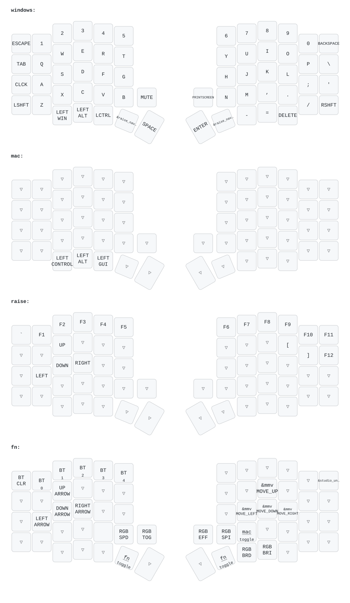

# VUHK Sofle

This is the ZMK config for my wireless Sofle. Both halves run on nice!nano v2 controllers, each side has a rotary encoder, there's RGB underglow, and every half gets a small screen. You can use it the normal way, where the left half talks to your computer, or with a separate USB dongle that both halves connect to.



GitHub Actions redraws that picture every time the keymap changes, so it should always match `config/sofle.keymap`.

## Getting the firmware

Every push to `main` builds all the firmware. Open the latest run in the **Actions** tab, download the `firmware` artifact, and unzip it. You won't need every file in there. Which ones you need depends on how you want to connect the board.

### Option 1: no dongle

The left half pairs with your computer and the right half connects to the left.

| Screen    | Left half                 | Right half                   |
| --------- | ------------------------- | ---------------------------- |
| nice!view | `central_left_nice_view`  | `peripheral_right_nice_view` |
| OLED      | `central_left_oled`       | `peripheral_right_oled`      |

### Option 2: with a dongle

The dongle is a spare nice!nano with an OLED that stays plugged into your computer. It handles the connection, so both halves only have to talk to the dongle. The left half's battery lasts a lot longer this way.

Flash one of these to the dongle:

- `central_dongle_oled` for a 1.3" 128x64 screen (SH1106)
- `central_dongle_oled_091` for a 0.91" 128x32 screen (SSD1306)

Then flash a `peripheral_left_*` file to the left half and a `peripheral_right_*` file to the right half.

### Screen flavors

- `*_nice_view`: the stock ZMK status screen for the nice!view
- `*_nice_view_planet` and `*_nice_view_astronaut`: the same nice!view, but with an animation
- `*_oled`: for regular I2C OLEDs, using the nice-oled widgets

The animated nice!view builds only come as peripherals. If the left half is your central, it uses the stock nice!view screen.

### Flashing

1. Plug a half in over USB and double-tap its reset button. A drive called `NICENANO` should show up.
2. Drag the `.uf2` file onto that drive. The board reboots on its own when it's done.
3. Do the same for the other half, and the dongle if you're using one.

If the halves won't find each other, or Bluetooth starts acting weird, flash `settings_reset` to every board, then flash the normal firmware again. It also helps to remove the keyboard from your computer's Bluetooth list before pairing it again.

## Layers

### Windows (base)

Plain QWERTY. Caps Lock is on the left end of the home row. The thumb keys, from left to right, are Win, Alt, Ctrl, Raise, Space, then Enter, Raise, `-`, `=`, Delete.

The left encoder controls volume, and clicking it mutes. The right encoder scrolls with Page Up and Page Down, and clicking it hits Print Screen.

### Mac

This layer sits on top of the base layer and changes only two things. The bottom-left modifiers become Ctrl, Option, Cmd, so shortcuts end up where your fingers expect them on a Mac. The right encoder also scrolls the other way. Turn it on or off with **Fn + M**.

### Raise

Hold either Raise key.

- The number row turns into F1 to F10. F11 is on Backspace, F12 is on `\`, and `` ` `` is on Esc.
- WASD becomes arrow keys.
- `[` and `]` are on O and P.

### Fn

Double-tap either Raise key to lock Fn on, and tap Raise once to get back out.

- **Bluetooth:** keys 1 to 5 pick a profile. Esc clears the current one.
- **Movement:** WASD are arrow keys, and IJKL moves the mouse pointer.
- **Underglow:** click the left encoder to turn it on or off, and click the right one to switch effects. B and N make the effect slower or faster. `-` and `=` make it dimmer or brighter. Turn the left encoder to change the color, and the right one to change saturation.
- **Mac layer:** M turns it on or off.
- **ZMK Studio:** Backspace unlocks it (see below).

## ZMK Studio

The central builds (`central_*`) support [ZMK Studio](https://zmk.studio), so you can remap keys from the browser without flashing anything. Plug in the left half or the dongle over USB, press **Fn + Backspace** to unlock, and connect.

## A few other things

- The keyboard shows up as **VUHK Sofle** in Bluetooth.
- The underglow turns off after a minute of doing nothing. After 15 minutes the board goes to deep sleep. Press a key to wake it.
- The nice!view builds use the `nice_view_adapter_rgb` shield. It moves the nice!view's CS pin to P1.01 so the screen and the underglow stop fighting over the same pin. Wiring notes are in [its README](boards/shields/nice_view_adapter_rgb/README.md).

## Building on your own machine

CI is the easy way. If you'd rather build locally, you need `python3`, `git`, `cmake`, `ninja`, `dtc`, and [Zephyr SDK](https://github.com/zephyrproject-rtos/sdk-ng/releases/tag/v0.17.0) 0.17.0 installed to `~/zephyr-sdk-0.17.0`. If you put the SDK somewhere else, set `ZEPHYR_SDK_INSTALL_DIR`.

Then run:

```sh
./build.py                     # build everything in build.yaml
./build.py central_left_oled   # or just the ones you name
```

If you already have ZMK set up at `../zmk` (a west workspace with a `.venv`, like ZMK's local setup guide makes), the script uses it as is. Otherwise the first run creates a venv and downloads ZMK and Zephyr into `.zmk/`, which is about 2 GB. Either way, the display modules get fetched into `.zmk/` at the commits pinned in `config/west.yml`. Later runs reuse all of that and only rebuild what changed.

Builds come from the same `build.yaml` that CI uses, so the file names match: every `<artifact-name>.uf2` lands in the repo root. If a build fails, its full output is in `.zmk/logs/<artifact-name>.log`. By default 4 builds run at once. Set `JOBS` to change that.

## Thanks

- [Sofle](https://github.com/josefadamcik/SofleKeyboard) by Josef Adamčík
- [ZMK](https://zmk.dev)
- [zmk-nice-oled](https://github.com/mctechnology17/zmk-nice-oled) by mctechnology17
- [zmk-dongle-display](https://github.com/englmaxi/zmk-dongle-display) by englmaxi
- [zmk-dongle-display-091-oled](https://github.com/GarrettFaucher/zmk-dongle-display-091-oled) by GarrettFaucher
- [keymap-drawer](https://github.com/caksoylar/keymap-drawer) by caksoylar
